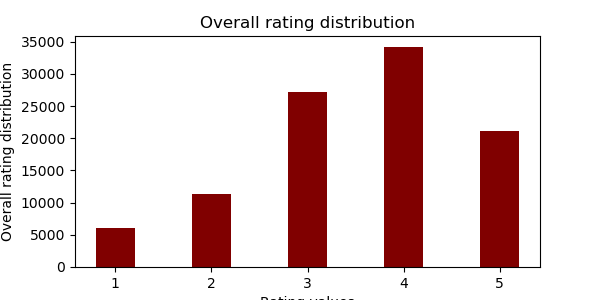
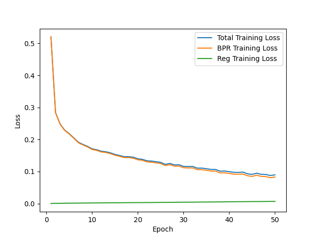
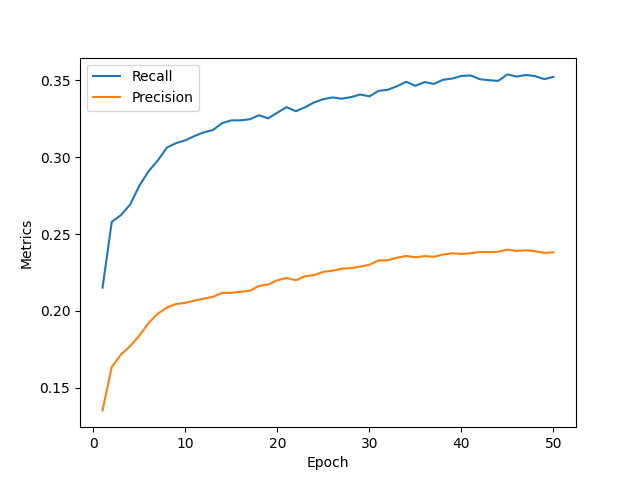
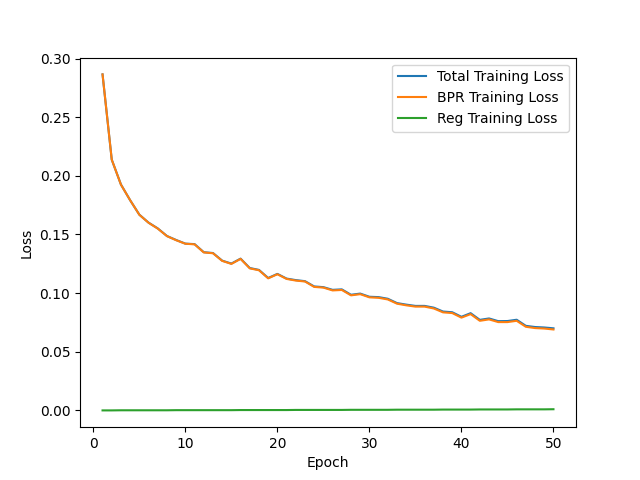

# Introduction
I used [MovieLens 100K dataset](https://grouplens.org/datasets/movielens/100k/) consisting user ratings to movies. The task was to create recommendation system

# Data analysis
Data analysis showed that users has different occupations and other info.\
Movie can belong to deifferent genres.
Rating distribution from all users for all movies looks:  \
3 the worst films by rating: Bird of Prey (1996), Tigrero: A Film That Was Never Made (1994), Hostile Intentions (1994) \
3 the best films: They Made Me a Criminal (1939), Great Day in Harlem, A (1994), Entertaining Angels: The Dorothy Day Story (1996)

# Model Implementation
There are 2 models: LightGCN and NGCF
First model is a graph convolutional neural network. Second is also graph convolutional, but it removes the learnable linear layers, non-linear activation, and dropout.

# Model Advantages and Disadvantages
The unique capabilities of graph models allow us to capture structural relationships between data and, thus, obtain more information than analyzing data separately. However, it is often very difficult to solve graph learning problems because many types of data are not inherently structured as graphs, such as image and text data, and for data with a graph structure, the underlying connectivity Models are often complex and varied.

# Training Process
Training looks usual except loss evaluation - it has both precision/recall and BPR parts. BPR is the Bayesian Personalized Ranking loss. 

# Evaluation
For evaluation I used best precision/recall and BPR values: \
For LightGCN:\
\
\

For NGCF:\
\

# Results

Comparing both models, LightGCN showed better performance in (precision, recall) - (0.2399, 0.3539) than NGCF - (0.2114, 0.3141).  But NGCF showed lower loss.